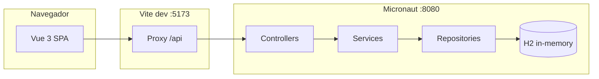

# Aluguel de Carros

> Sistema acadêmico para **cadastro de clientes** e **gestão de pedidos de aluguel de veículos**, com API REST em **Micronaut** e interface web em **Vue 3**. O back-end persiste dados em **H2 (em memória)** no ambiente padrão do repositório.

<table>
  <tr>
    <td width="800px">
      <div align="justify">
        Este repositório reúne o <b>front-end</b> (<code>frontend/alguelcarros-front</code>) e o <b>back-end</b> (<code>demo</code>). O front-end consome a API via proxy de desenvolvimento do Vite: requisições a <code>/api</code> são encaminhadas para o Micronaut em <code>http://localhost:8080</code>, com remoção do prefixo <code>/api</code>.
      </div>
    </td>
    <td>
      <div>
        
      </div>
    </td>
  </tr>
</table>

---

## Status do Projeto


---

## Índice

- [Links úteis](#links-úteis)
- [Sobre o projeto](#sobre-o-projeto)
- [Funcionalidades principais](#funcionalidades-principais)
- [Tecnologias utilizadas](#tecnologias-utilizadas)
- [Arquitetura](#arquitetura)
- [Instalação e execução](#instalação-e-execução)
- [Estrutura de pastas](#estrutura-de-pastas)
- [API REST (referência rápida)](#api-rest-referência-rápida)
- [Testes](#testes)
- [Documentação consultada](#documentação-consultada)
- [Autores](#autores)
- [Licença](#licença)

---

## Links úteis

| Recurso | Observação |
|--------|------------|
| [Micronaut Guide](https://guides.micronaut.io/) | Guias oficiais do framework |
| [Vue.js](https://vuejs.org/) | Documentação do Vue 3 |
| [Vite](https://vite.dev/) | Configuração e modo dev |

*Não há deploy ou demo online configurados neste repositório; ajuste os links acima se publicar a aplicação.*

---

## Sobre o projeto

O **Aluguel de Carros** é um trabalho acadêmico que simula o fluxo de **clientes** que solicitam **pedidos de aluguel** (veículo, valores, prazo) e acompanhamento por **status** (pendente, em análise, aprovado, reprovado, cancelado). A API centraliza regras e persistência; a interface web permite operar cadastros e pedidos de forma simples.

**Problema abordado:** organizar dados de clientes e pedidos de locação com uma API clara e um cliente HTTP que reflita o domínio (clientes, pedidos, status).

**Contexto:** projeto de laboratório / disciplina, com foco em camadas (controller, service, repositório) e SPA consumindo REST.

---

## Funcionalidades principais

- **Clientes:** listar, criar, buscar por id, atualizar e remover (conforme exposto na API; o front-end atual usa listar, criar e remover).
- **Pedidos de aluguel:** criar pedido vinculado a cliente; listar pedidos por cliente; buscar pedido por id; atualizar status via `PATCH`.
- **Interface web:** páginas **Início**, **Clientes** e **Pedidos** (Vue Router), formulários e feedback de operações.

---

## Tecnologias utilizadas

### Front-end (`frontend/alguelcarros-front`)

- **Vue 3** com **Composition API** e **TypeScript**
- **Vue Router 4**
- **Vite 6** (dev server na porta **5173**, proxy `/api` → `http://localhost:8080`)
- Estilos em **CSS** (`src/style.css`)

### Back-end (`demo`)

- **Java 17**
- **Micronaut 4** (runtime Netty, validação HTTP, Micronaut Serialization / Jackson)
- **Micronaut Data JPA** com **Hibernate** e **HikariCP**
- **H2** em memória (configuração padrão em `application.properties`)
- **Gradle** (wrapper incluso: `./gradlew`)
- **JUnit 5** para testes

---

## Arquitetura

- **Back-end:** estilo em camadas — **controllers** REST (`@Controller`), **services** com regras de negócio, **repositories** (Micronaut Data), **modelos** JPA em `com.aluguelcarros.model`, DTOs de entrada/saída em `request` e `response`, tratamento global em `exception`.
- **Front-end:** SPA com **rotas** por view; chamadas HTTP centralizadas em `src/api.ts` (prefixo `/api`); estado e ações em `composables/useRentalsApp.ts`.
- **Integração local:** o navegador chama apenas `/api/...` no mesmo host do Vite; o proxy reescreve para os paths do Micronaut (`/clientes`, `/pedidos`, …).



---

## Instalação e execução

### Pré-requisitos

- **JDK 17** (toolchain definido no `demo/build.gradle`)
- **Node.js** 18+ (recomendado LTS) e **npm**

### 1. Clonar e entrar na raiz do repositório

```bash
git clone https://github.com/AnaFlaviaRibeiro/sistema-matricula
cd sistema-matricula
```

### 2. Back-end (Micronaut)

Na pasta `demo`:

```bash
cd demo
./gradlew run
```

A API sobe por padrão em **http://localhost:8080** (porta padrão do Micronaut quando não configurada de outro modo).

### 3. Front-end (Vue + Vite)

Em outro terminal, na pasta do projeto Vue:

```bash
cd frontend/alguelcarros-front
npm install
npm run dev
```

Abra **http://localhost:5173**. O proxy do Vite encaminha `/api` para o back-end.

### Build de produção

**Front-end:**

```bash
cd frontend/alguelcarros-front
npm run build
```

Saída em `frontend/alguelcarros-front/dist`. Em produção é necessário servir o SPA e **procurar a API** (por exemplo, mesmo host com reverse proxy que mapeie `/api` para o Micronaut) ou ajustar `src/api.ts` para usar uma URL absoluta.

**Back-end (JAR):**

```bash
cd demo
./gradlew shadowJar
```

O artefato gerado pelo plugin Shadow fica em `demo/build/libs/` (nome conforme versão do projeto).

### Banco de dados

O perfil padrão usa **H2 em memória** (`jdbc:h2:mem:devDb`), com geração de schema (`schema-generate=CREATE_DROP` / Hibernate). **Não é obrigatório** Docker ou PostgreSQL para rodar o estado atual do repositório.

---

## Estrutura de pastas

```
.
├── README.md
├── demo/                              # Back-end Micronaut (API REST)
│   ├── build.gradle
│   ├── settings.gradle
│   ├── gradlew
│   └── src/main/java/com/aluguelcarros/
│       ├── Application.java
│       ├── controller/                # REST: ClienteController, PedidoAluguelController
│       ├── service/
│       ├── repository/
│       ├── model/                     # Entidades JPA + enums em model/type
│       ├── request/ / response/
│       └── exception/
│   └── src/main/resources/
│       ├── application.properties
│       └── logback.xml
│
└── frontend/
    └── alguelcarros-front/            # Front-end Vue 3 + Vite
        ├── package.json
        ├── vite.config.ts             # proxy /api → localhost:8080
        ├── index.html
        └── src/
            ├── main.ts
            ├── App.vue
            ├── api.ts
            ├── router/index.ts
            ├── composables/useRentalsApp.ts
            ├── types/api.ts
            ├── views/                   # HomeView, ClientesView, PedidosView
            └── style.css
```

---

## API REST (referência rápida)

Base no Micronaut (sem prefixo `/api`): **http://localhost:8080**

| Método | Caminho | Descrição |
|--------|---------|-----------|
| `GET` | `/clientes` | Lista clientes |
| `POST` | `/clientes` | Cria cliente |
| `GET` | `/clientes/{id}` | Busca por id |
| `PUT` | `/clientes/{id}` | Atualiza |
| `DELETE` | `/clientes/{id}` | Remove |
| `POST` | `/pedidos` | Cria pedido |
| `GET` | `/pedidos/{id}` | Busca pedido |
| `GET` | `/pedidos/cliente/{clienteId}` | Lista por cliente |
| `PATCH` | `/pedidos/{id}/status/{status}` | Atualiza status |

**Exemplo (listar clientes):**

```bash
curl -s http://localhost:8080/clientes
```

---

## Testes

**Back-end:**

```bash
cd demo
./gradlew test
```

O front-end não define script `test` no `package.json` atual; testes E2E ou unitários de Vue podem ser adicionados conforme a disciplina exigir.

---

## Documentação consultada

- [Micronaut Documentation](https://docs.micronaut.io/)
- [Micronaut Data JPA](https://micronaut-projects.github.io/micronaut-sql/latest/guide/index.html#hibernate)
- [Vue 3](https://vuejs.org/guide/introduction.html)
- [Vite](https://vite.dev/config/)

---

## Autores

Projeto desenvolvido pelos alunos:

| Nome |
|------|
| **Ana Flávia de Souza Ribeiro** |
| **Miguel Martins** |

---

## Licença

Defina a licença do trabalho acadêmico conforme orientação da disciplina (por exemplo, adicione um arquivo `LICENSE` na raiz do repositório).

---

## Agradecimentos

- [**Engenharia de Software PUC Minas**](https://www.instagram.com/engsoftwarepucminas/)
- [**Prof. Dr. João Paulo Aramuni**](https://github.com/joaopauloaramuni) — referência de documentação e boas práticas em README (template acadêmico).
